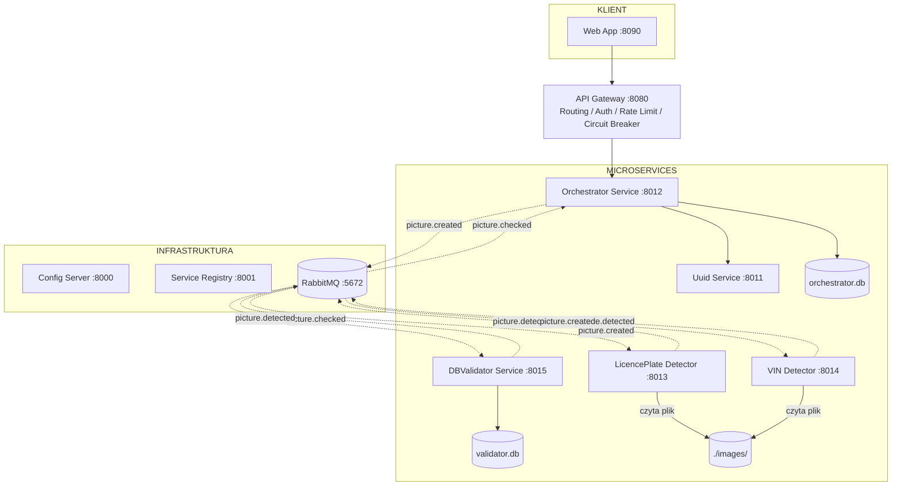

# Klio — Dokumentacja architektury systemu

## 1. Opis systemu

Klio to prototyp aplikacji do wykrywania i weryfikacji danych pojazdów na podstawie zdjęć. System umożliwia likwidatorowi szkód komunikacyjnych przesłanie nazw plików graficznych i uzyskanie informacji o numerze rejestracyjnym oraz numerze VIN widocznym na zdjęciach, wraz z danymi z bazy (opis pojazdu, rok produkcji).

---

## 2. Architektura

System składa się z 9 serwisów (plus RabbitMQ) zbudowanych w architekturze mikroserwisowej z wzorcami: API Gateway, Service Discovery, Circuit Breaker, Config Server i Event-Driven.



---

## 3. Serwisy

### 3.1 Config Server (port 8000)

Centralne źródło konfiguracji dla wszystkich serwisów.

| Endpoint | Opis |
|---|---|
| `GET /config/{service_name}` | Zwraca konfigurację JSON dla danego serwisu |
| `GET /health` | Sprawdzenie stanu serwisu |

Pliki konfiguracyjne przechowywane w `app/configs/{service_name}.json`.

---

### 3.2 Service Registry (port 8001)

Rejestr serwisów z automatycznym healthcheckiem co 30 sekund.

| Endpoint | Opis |
|---|---|
| `GET /services` | Lista zarejestrowanych serwisów ze statusami |
| `POST /register` | Rejestracja serwisu |
| `DELETE /deregister/{name}` | Wyrejestrowanie serwisu |
| `GET /health` | Sprawdzenie stanu serwisu |

---

### 3.3 UUID Service (port 8011)

Prosta usługa generowania unikalnych identyfikatorów dla inspekcji.

| Endpoint | Opis |
|---|---|
| `POST /uuid/generate` | Generuje UUID4, zwraca `{"uuid": "..."}` |
| `GET /health` | Sprawdzenie stanu serwisu |

---

### 3.4 Orchestrator Service (port 8012)

Główna usługa biznesowa. Przyjmuje żądania inspekcji, koordynuje przepływ, przechowuje stan w `orchestrator.db`, obsługuje kolejkę `picture.checked`.

| Endpoint | Opis |
|---|---|
| `POST /inspections` | Tworzy inspekcję, publikuje zdarzenia `picture.created` |
| `GET /inspections/{uuid}` | Zwraca aktualny stan inspekcji |
| `GET /health` | Sprawdzenie stanu serwisu |

**Walidacja:** żądanie musi zawierać co najmniej 3 nazwy plików. Przy mniejszej liczbie zwracany jest błąd HTTP 422 z komunikatem `"Należy przesłać min 3 zdjęcia!"`.

**Statusy inspekcji:**
- `pending` — inspekcja w toku
- `completed` — oba pola (`licenceplate` i `vin`) zostały uzupełnione

---

### 3.5 LicencePlate Detector (port 8013)

Konsument zdarzeń `picture.created`. Wczytuje plik ze współdzielonego storage'a (`/app/images/`), uruchamia detekcję (lub tryb mock), publikuje `picture.detected` z typem `LICENCEPLATE`.

- **Opóźnienie detekcji:** 8 sekund
- **Tryb mock:** gdy brak pliku `licenceplate-model.pt`, zwraca losową tablicę z listy: `WW12345`, `KR98765`, `PO11223`, `GD77654`, `WR34567`
- **Tryb YOLO:** importuje model z `ultralytics` (klasa `YOLO`), plik `licenceplate-model.pt`

---

### 3.6 VIN Detector (port 8014)

Symetryczny do LicencePlate Detector. Konsument zdarzeń `picture.created`, publikuje `picture.detected` z typem `VIN`.

- **Opóźnienie detekcji:** 3 sekundy
- **Tryb mock:** losowy VIN z listy: `VF1LM1B0H35296680`, `WAUZZZ8K9BA012345`, `WBA3A5C58CF256551`, `2T1BURHE0JC028581`, `VF7NC5FWC31614893`
- **Tryb YOLO:** plik `vin-model.pt`

---

### 3.7 DBValidator Service (port 8015)

Konsument zdarzeń `picture.detected` (oba typy w jednej kolejce, routing po polu `type`). Weryfikuje wykryte wartości w bazie `validator.db` i publikuje `picture.checked`.

**Logika:**
- `type == "LICENCEPLATE"` → szuka w tabeli `LICENCEPLATE`, zwraca `desc`
- `type == "VIN"` → szuka w tabeli `VIN`, zwraca `car` i `production_year`

---

### 3.8 API Gateway (port 8080)

Punkt wejścia dla klientów zewnętrznych. Realizuje:

- **Routing** — na podstawie pierwszego segmentu URL mapuje żądanie do serwisu docelowego (`/api/inspections` → `orchestrator-service`)
- **Autentykacja** — nagłówek `X-API-Key: demo-key-123`
- **Rate limiting** — 60 żądań/minutę (per IP, biblioteka `slowapi`)
- **Circuit Breaker** — 3 błędy → stan `open` (serwis niedostępny), reset po 30 sekundach

| Endpoint | Opis |
|---|---|
| `GET/POST /api/{resource}/**` | Proxy do serwisu docelowego |
| `GET /api/gateway/breakers` | Stan circuit breakerów |
| `GET /health` | Sprawdzenie stanu serwisu |

---

### 3.9 Web App (port 8090)

Interfejs graficzny (Bootstrap 5, Jinja2). Komunikuje się z systemem wyłącznie przez API Gateway.

| Endpoint | Opis |
|---|---|
| `GET /` | Formularz z checkboxami dostępnych plików |
| `POST /submit` | Wysyła wybrane nazwy plików do API Gateway |
| `GET /results/{uuid}` | Wyniki inspekcji (auto-refresh co 3s gdy `pending`) |
| `GET /health` | Sprawdzenie stanu serwisu |

**Dostępne pliki:** `img-1.jpeg`, `img-2.jpeg`, `img-3.jpeg`, `img-4.jpeg`

---

## 4. Przepływ zdarzeń

```
POST /api/inspections {"filenames": ["img-1.jpeg", "img-2.jpeg", "img-3.jpeg"]}
  → API Gateway (auth + rate limit + circuit breaker)
  → Orchestrator: walidacja min 3 plików
  → UUID Service: generuje UUID
  → Orchestrator: INSERT BOX (status=pending)
  → Orchestrator: publish picture.created × N (jedna wiadomość na plik)
  ← {"inspection_id": "<uuid>"}  HTTP 201

RabbitMQ exchange: "microservices" (TOPIC)

picture.created → licenceplate-detector-q
  → wczytuje /app/images/{filename}
  → asyncio.sleep(8)
  → YOLO lub mock
  → publish picture.detected {type:"LICENCEPLATE", value, inspection_id, filename}

picture.created → vin-detector-q
  → wczytuje /app/images/{filename}
  → asyncio.sleep(3)
  → YOLO lub mock
  → publish picture.detected {type:"VIN", value, inspection_id, filename}

picture.detected → dbvalidator-q
  → LICENCEPLATE: find_licenceplate(value) → {valid, desc}
  → VIN:          find_vin(value)          → {valid, car, production_year}
  → publish picture.checked {type, value, valid, ...meta, inspection_id, filename}

picture.checked → orchestrator-q
  → UPDATE BOX (licenceplate/vin fields)
  → INSERT BOX_DETAIL (picture, attr_name, attr_value)
  → jeśli licenceplate AND vin NOT NULL → UPDATE BOX status="completed"

GET /api/inspections/{uuid}
  → Orchestrator: SELECT BOX WHERE uuid=?
  → zwraca stan BOX (polling co 3s przez Web App)
```

---

## 5. Model danych

### orchestrator.db

**Tabela BOX**

| Kolumna | Typ | Opis |
|---|---|---|
| uuid | String PK | Identyfikator inspekcji |
| created | String | Timestamp utworzenia |
| picture_number | Integer | Liczba przesłanych plików |
| status | String | `pending` / `completed` |
| licenceplate | String? | Wykryty numer rejestracyjny |
| licenceplate_status | String? | `found` / `not_found` |
| licenceplate_desc | String? | Opis z bazy (np. "Toyota Corolla, Warszawa") |
| vin | String? | Wykryty numer VIN |
| vin_status | String? | `found` / `not_found` |
| vin_car | String? | Marka/model z bazy |
| vin_production_year | String? | Rok produkcji |

**Tabela BOX_DETAIL**

| Kolumna | Typ | Opis |
|---|---|---|
| id | Integer PK | Autoincrement |
| uuid | String | FK do BOX.uuid |
| picture | String | Nazwa pliku |
| attr_name | String | Typ atrybutu: `LICENCEPLATE` lub `VIN` |
| attr_value | String | Wykryta wartość |

---

### validator.db

**Tabela LICENCEPLATE** (5 rekordów testowych)

| licenceplate | desc |
|---|---|
| WW12345 | Toyota Corolla, Warszawa |
| KR98765 | BMW 3 Series, Kraków |
| PO11223 | Ford Focus, Poznań |
| GD77654 | Volkswagen Golf, Gdańsk |
| WR34567 | Audi A4, Wrocław |

**Tabela VIN** (5 rekordów testowych)

| vin | car | production_year |
|---|---|---|
| VF1LM1B0H35296680 | Renault Megane | 2017-06-15 |
| WAUZZZ8K9BA012345 | Audi A4 | 2019-03-20 |
| WBA3A5C58CF256551 | BMW 3 Series | 2012-11-08 |
| 2T1BURHE0JC028581 | Toyota Corolla | 2018-09-01 |
| VF7NC5FWC31614893 | Citroën C5 | 2015-04-22 |

---

## 6. Kolejki RabbitMQ

| Kolejka | Binding key | Konsument |
|---|---|---|
| `licenceplate-detector-q` | `picture.created` | licenceplate-detector |
| `vin-detector-q` | `picture.created` | vin-detector |
| `dbvalidator-q` | `picture.detected` | dbvalidator-service |
| `orchestrator-q` | `picture.checked` | orchestrator-service |

Exchange: `microservices` (typ: `topic`, durable: true)

---

## 7. Uruchomienie

### Wymagania

- Docker 24+
- Docker Compose v2
- Katalog `images/` z plikami `img-1.jpeg` … `img-4.jpeg`
- Katalog `models/` (opcjonalnie) z plikami `licenceplate-model.pt` i `vin-model.pt`

### Start

```bash
docker compose up --build
```

Jeśli pliki `.pt` są nieobecne, detektory uruchamiają się w trybie mock i zwracają losowe wyniki z predefiniowanych list.

### Porty

| Serwis | URL |
|---|---|
| Web App | http://localhost:8090 |
| API Gateway | http://localhost:8080 |
| Service Registry | http://localhost:8001/services |
| RabbitMQ Management | http://localhost:15672 (guest/guest) |
| Config Server | http://localhost:8000 |

---

## 8. Weryfikacja działania

1. Otwórz http://localhost:8001/services — powinno być widocznych 9 serwisów ze statusem `up`
2. Otwórz http://localhost:8090
3. Zaznacz mniej niż 3 pliki → błąd `"Należy przesłać min 3 zdjęcia!"`
4. Zaznacz 3 lub więcej plików i wyślij
5. Strona wyników pokazuje UUID i status `pending` z animacją ładowania
6. Po ok. 3–8 sekundach status zmienia się na `completed`, wyświetlają się wykryte tablice/VIN z danymi z bazy
7. http://localhost:8080/api/gateway/breakers — stan circuit breakerów

---

## 9. Stos technologiczny

| Technologia | Rola |
|---|---|
| Python 3.12 | Język implementacji |
| FastAPI | Framework HTTP |
| Uvicorn | ASGI server |
| Poetry | Zarządzanie zależnościami |
| aio-pika | Klient RabbitMQ (async) |
| SQLAlchemy + aiosqlite | ORM + async SQLite |
| ultralytics (YOLO) | Detekcja obiektów (opcjonalnie) |
| pydantic-settings | Konfiguracja z ENV |
| httpx | Klient HTTP (async) |
| slowapi | Rate limiting |
| Bootstrap 5 | UI |
| Docker / Docker Compose | Konteneryzacja |
| RabbitMQ 3.13 | Message broker |
