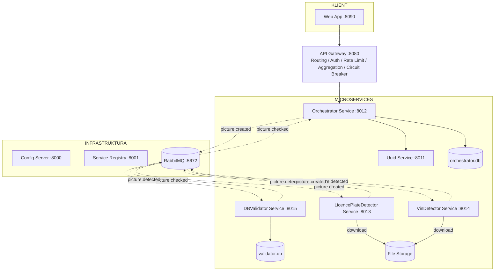

## Zadanie

Celem zadania jest zbudowanie prototypu aplikacji do wykrywania i weryfikacji danych o samochodach na dostarczonych zdjęciach (pliki graficzne - jpg, jpeg, png).

## Wymagania funkcjonalne

Likwidator szkody komunikacyjnej (użytkownik systemu) chcę móc przesłać do aplikacji nazwy plików graficznych(zdjęcia pojazdu) żeby otrzymać informacje z systemu na temat numeru rejestracyjnego pojazdu i numeru identyfikacyjnego pojazdu (VIN).
System powinien być w stanie:
* pobrać wskazane pliki graficzne (zdjęcia) ze storage'a;
* przekazać zdjęcia do modeli analitycznych odpowiedzialnych za wykrywanie numerów rejestracyjnych i VIN;
* po wykryciu na zdjęciu numeru rejestracyjnego pojazdu zweryfikować jego obecność w bazie danych i przesłać dodatkowe informacje z tej bazy do użytkownika systemu;

Jako modele analityczne będzie wykorzystywany algorytm YOLO.
Proces uczenia sieci neuronowej nie wchodzi w zakres tego zadania.
Wagi z procesu treningu algorytmu zostaną dostarczone do aplikacji jako pliki *.pt (katalog models):
* vin-model.pt - detekcja numerów VIN
* licenceplate-model.pt - detekcja numerów rejestracyjnych pojazdu
Usługa LICENCEPLATEDETECTOR zaimportuje plik licenceplate-model.pt.
Usługa VINDETECTOR zaimportuje plik vin-model.pt.

## Wymagania niefunkcjonalne

Aplikacja będzie zbudowana w architekturze microservice'owej w oparciu o wzorce projektowe takie jak:
* API Gateway
* Service Discovery
* Circuit Breaker
* Config Server
* Event-Driven

Technologia do wykorzystania:
* Python - https://www.python.org/
* FastAPI - https://fastapi.tiangolo.com/
* Poetry - https://python-poetry.org/
* RabbitMQ - https://www.rabbitmq.com/
* SqlLite - https://sqlite.org/
* Docker - https://www.docker.com/
* Docker_compose - https://docs.docker.com/compose/
* Bootstrap - https://getbootstrap.com/

Utwórz strukturę projektu wzorując się na git@github.com:pmscottx/cc-app-005.git.

## Architektura

## Przeznaczenie usług

Usługa UUID:
* generuje unikalny UID dla paczki nadesłanych plików - bedzie on zwracany do klienta zaraz po przesłaniu paczki zdjęć 

Usługa LICENCEPLATEDETECTOR:
* importuje wytrenowany model analityczny (licenceplate-model.pt), który zwraca numer rejestracyjny pojazdu jeżeli takowy występuje na zdjęciu
* wczytuje zdjęcie (plik jpg, jpeg, png) ze dysku
* w przypadku wykrycia numeru rejestracyjnego pojazdu wyśle ten numer na kolejkę
* w przypadku braku wykrycia - zaloguje ten fakt 
* czas trwania detekcji to 8 sekund (zasymuluj takie opóźnienie)

Usługa VINDETECTOR:
* importuje wytrenowany model analityczny (vin-model.pt), który zwraca numer VIN jeżeli takowy występuje na zdjęciu
* wczytuje zdjęcie (plik jpg, jpeg, png) ze dysku
* w przypadku wykrycia numeru VIN wyśle ten numer na kolejkę
* w przypadku braku wykrycia - zaloguje ten fakt 
* czas trwania detekcji to 3 sekundy (zasymuluj takie opóźnienie)

Usługa DBVALIDATOR:
* pobiera wykryty przez LICENCEPLATEDETECTOR numer rejestracyjny pojazdu z kolejki, weryfikuje jego obecność w bazie danych i zwraca dodatkowe informacje pochodzące z tej bazy
* pobiera wykryty przez VINDETECTOR numer VIN z kolejki, weryfikuje jego obecność w bazie danych i zwraca dodatkowe informacje pochodzące z tej bazy

Usługa ORCHESTRATOR:
* zawiera reguły walidacyjne dot. nadesłanej paczki plików (jeżeli przekazano mniej niż 3 pliki - zwróć błąd "Należy przesłać min 3 zdjęcia!")
* po otrzymaniu requestu i pobraniu UUID zapisze rekord w bazie orchestrator.db
* iteruje po nadesłanych nazwach plików - przekazując je asynchronicznie do detekcji (LICENCEDETECTOR i VINDETECTOR)
* otrzymuje informacje zwrotne na temat zidentyfikowanych numerów rejestracyjnych pojadów i VIN, które będą zwrócone do klienta

Usługa WEB:
* interfejs graficzny pozwalający przekazać listę nazw plików graficznych 
* interfejs graficzny, będzie prezentował klientowi uuid, wynik detekcji wraz z informacjami z baz danych

## Model danych

### Baza validator.db

Encja LICENCEPLATE:
* licenceplate String PK
* desc String

wygeneruj 5 rekordów polskich numerów tablic wraz z opisem

Encja VIN:
* vin String PK
* car String
* production_year Date

wygeneruj 5 rekordów z numerm VIN wraz z marką pojazdu i rokiem jego produkcji

### Baza orchestrator.db

Encja BOX:
* uuid String PK
* created String
* picture_number Number

Encja BOX_DETAIL:
* uuid String PK
* picture String PK
* attr_name String // klucz wskazujący na obiekt jaki wykryto np. LICENCEPLATE, VIN
* attr_value String // zawartość np. LU 88153, WVWZZZ1JZXW000347